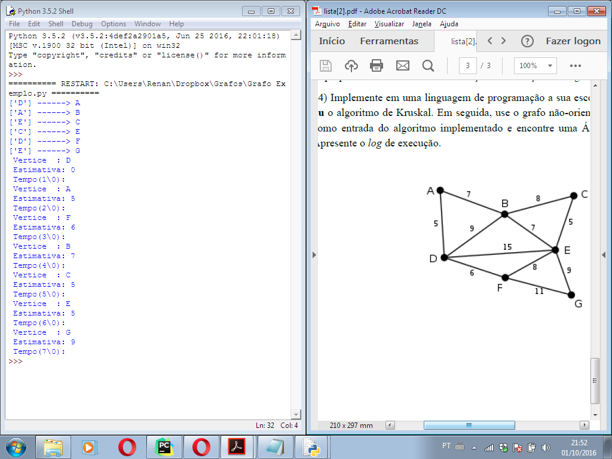

# Grafos-Python
## Grafos orientado a objetos implementado em Python

  * `def Dijkstra()`
  * `def Breadth_first_search()`
  * `def Depth_first_search()`
  * `def Minimum_panning_tree()`
  * `def Bellman_Ford()`

